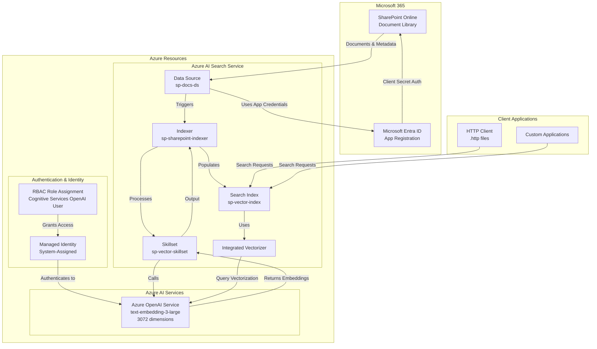
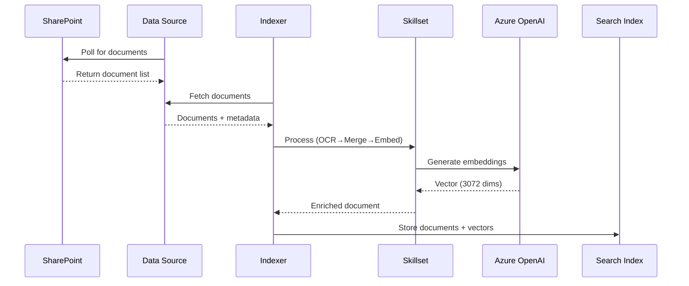
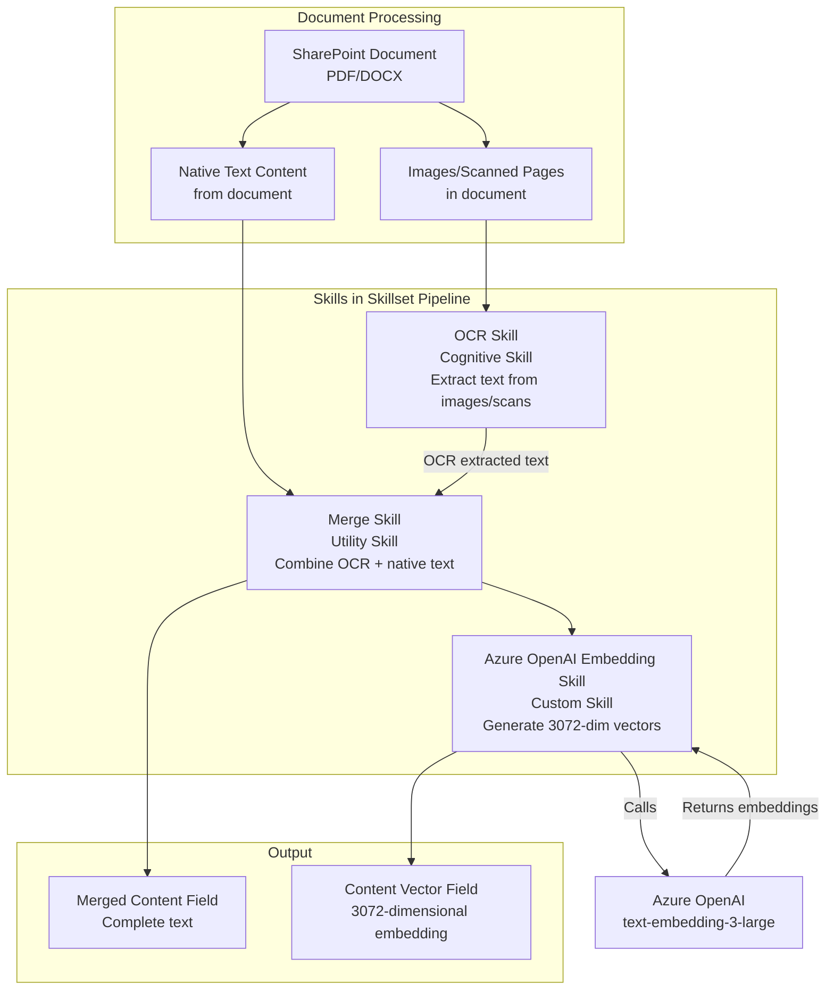
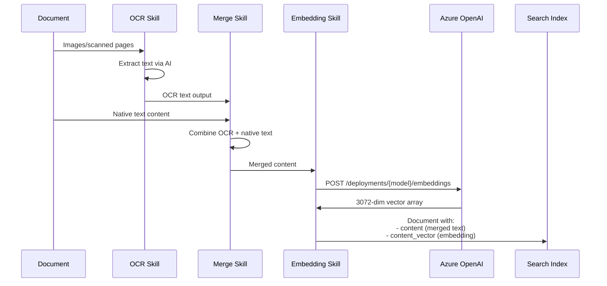
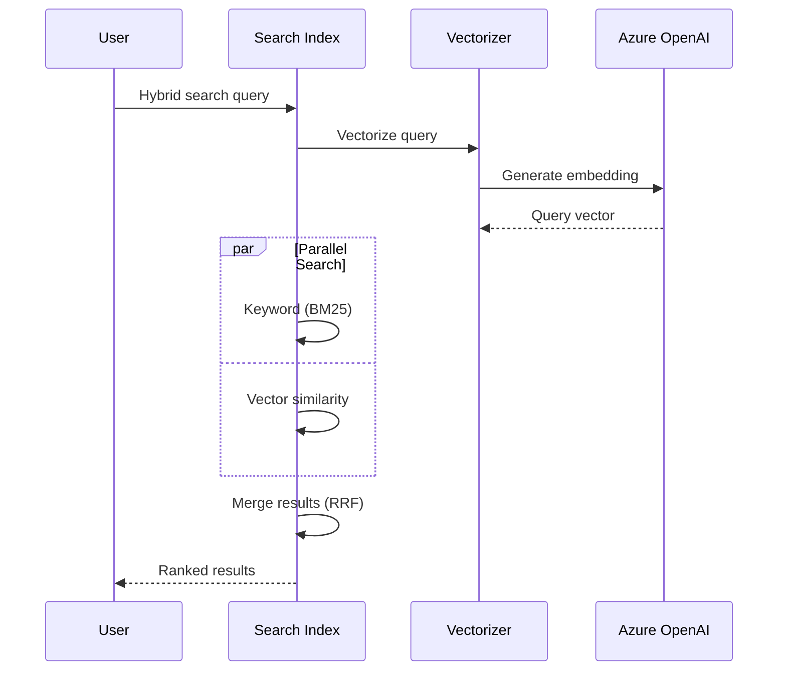

# Main Architecture Diagram

```mermaid

graph TB
    subgraph "Microsoft 365"
        SP[SharePoint Online<br/>Document Library]
        AAD[Microsoft Entra ID<br/>App Registration]
    end
    
    subgraph "Azure Resources"
        subgraph "Authentication & Identity"
            MI[Managed Identity<br/>System-Assigned]
            RBAC[RBAC Role Assignment<br/>Cognitive Services OpenAI User]
        end
        
        subgraph "Azure AI Services"
            AOAI[Azure OpenAI Service<br/>text-embedding-3-large<br/>3072 dimensions]
        end
        
        subgraph "Azure AI Search Service"
            DS[Data Source<br/>sp-docs-ds]
            SS[Skillset<br/>sp-vector-skillset]
            IDX[Search Index<br/>sp-vector-index]
            IDXR[Indexer<br/>sp-sharepoint-indexer]
            VEC[Integrated Vectorizer]
        end
    end
    
    subgraph "Client Applications"
        HTTP[HTTP Client<br/>.http files]
        APP[Custom Applications]
    end
    
    %% Authentication Flow
    AAD -->|Client Secret Auth| SP
    DS -->|Uses App Credentials| AAD
    MI -->|Authenticates to| AOAI
    RBAC -->|Grants Access| MI
    
    %% Data Flow
    SP -->|Documents & Metadata| DS
    DS -->|Triggers| IDXR
    IDXR -->|Processes| SS
    SS -->|Calls| AOAI
    AOAI -->|Returns Embeddings| SS
    SS -->|Output| IDXR
    IDXR -->|Populates| IDX
    
    %% Query Flow
    HTTP -->|Search Requests| IDX
    APP -->|Search Requests| IDX
    VEC -->|Query Vectorization| AOAI
    IDX -->|Uses| VEC
```

# Indexing Pipeline Flow

```mermaid
sequenceDiagram
    participant SP as SharePoint
    participant DS as Data Source
    participant IDXR as Indexer
    participant SS as Skillset
    participant AOAI as Azure OpenAI
    participant IDX as Search Index
    
    DS->>SP: Poll for documents
    SP-->>DS: Return document list
    IDXR->>DS: Fetch documents
    DS-->>IDXR: Documents + metadata
    IDXR->>SS: Process (OCR→Merge→Embed)
    SS->>AOAI: Generate embeddings
    AOAI-->>SS: Vector (3072 dims)
    SS-->>IDXR: Enriched document
    IDXR->>IDX: Store documents + vectors
```
# Detailed Skillset Processing Flow

```mermaid
graph TB
    subgraph "Skills in Skillset Pipeline"
        OCR[OCR Skill<br/>Cognitive Skill<br/>Extract text from images/scans]
        MERGE[Merge Skill<br/>Utility Skill<br/>Combine OCR + native text]
        EMBED[Azure OpenAI Embedding Skill<br/>Custom Skill<br/>Generate 3072-dim vectors]
    end
    
    subgraph "Document Processing"
        DOC[SharePoint Document<br/>PDF/DOCX]
        NATIVE[Native Text Content<br/>from document]
        IMAGES[Images/Scanned Pages<br/>in document]
    end
    
    subgraph "Output"
        MERGED[Merged Content Field<br/>Complete text]
        VECTOR[Content Vector Field<br/>3072-dimensional embedding]
    end
    
    DOC --> NATIVE
    DOC --> IMAGES
    
    IMAGES --> OCR
    NATIVE --> MERGE
    OCR -->|OCR extracted text| MERGE
    MERGE --> MERGED
    MERGE --> EMBED
    EMBED -->|Calls| AOAI[Azure OpenAI<br/>text-embedding-3-large]
    AOAI -->|Returns embeddings| EMBED
    EMBED --> VECTOR
```
# Sequence with All Skills

```mermaid
sequenceDiagram
    participant DOC as Document
    participant OCR as OCR Skill
    participant MERGE as Merge Skill
    participant EMBED as Embedding Skill
    participant AOAI as Azure OpenAI
    participant INDEX as Search Index
    
    DOC->>OCR: Images/scanned pages
    OCR->>OCR: Extract text via AI
    OCR->>MERGE: OCR text output
    
    DOC->>MERGE: Native text content
    MERGE->>MERGE: Combine OCR + native text
    MERGE->>EMBED: Merged content
    
    EMBED->>AOAI: POST /deployments/{model}/embeddings
    AOAI->>EMBED: 3072-dim vector array
    
    EMBED->>INDEX: Document with:<br/>- content (merged text)<br/>- content_vector (embedding)
    
```
# Hybrid Search Query Flow

```mermaid

sequenceDiagram
    participant USER as User
    participant IDX as Search Index
    participant VEC as Vectorizer
    participant AOAI as Azure OpenAI
    
    USER->>IDX: Hybrid search query
    IDX->>VEC: Vectorize query
    VEC->>AOAI: Generate embedding
    AOAI-->>VEC: Query vector
    par Parallel Search
        IDX->>IDX: Keyword (BM25)
    and
        IDX->>IDX: Vector similarity
    end
    IDX->>IDX: Merge results (RRF)
    IDX-->>USER: Ranked results

```